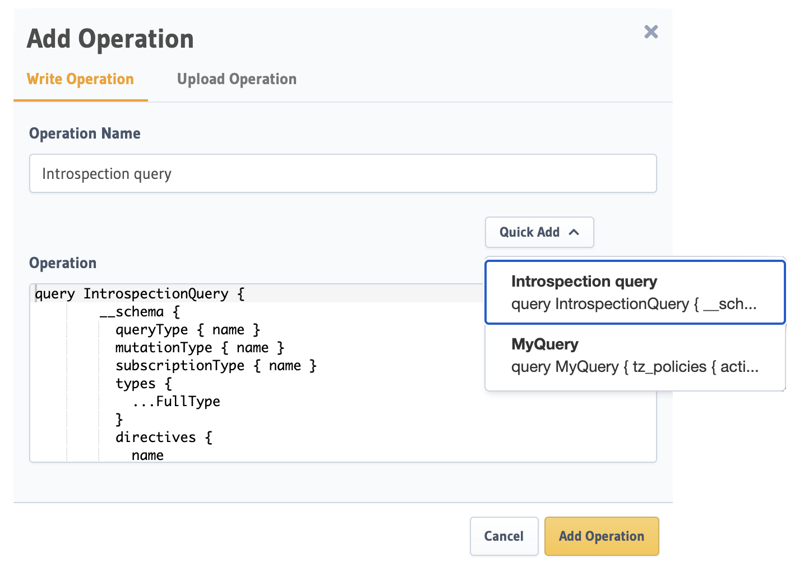

# Hasura

GraphQL APIs with Hasura


## TODO

- [ ] Add **Authentication** and **Object Storage** for Hasura using [Hasura Backend Plus](https://nhost.github.io/hasura-backend-plus/) container

## hasura-cli

### Install

```shell
pnpm add -g hasura-cli
# (OR)
go install github.com/hasura/graphql-engine/cli/cmd/hasura@latest
```

### Usage

NOTE: You can pass `--endpoint <hasura-endpoint> --admin-secret <admin-secret> command-line args for all _Hasura CLI_ commands

```shell
# Create a directory to store migrations (with endpoint and admin secret configured):
# use `''` to escape if `admin-secret` has special characters
hasura init hasura --project infra --endpoint https://erraxvkmnzplotebnxuy.hasura.us-east-1.nhost.run --admin-secret '<my-admin-secret>'
# move infra/hasura/config.yaml to project root and edit metadata_directory, migrations_directory, seeds_directory paths

hasura version

## open console
hasura console

# Create a new seed by exporting data from tables already present in the database:
hasura seed create organization_seed --database-name default --from-table organization
hasura seed create direction_seed --database-name default --from-table direction
hasura seed create action_seed --database-name default --from-table action
hasura seed create subject_type_seed --database-name default --from-table subject_type
hasura seed create policies_seed --database-name default --from-table policies
# Export data from multiple tables:
# hasura seed create policies_organization_seed --database-name default --from-table policies --from-table organization
# Apply only a particular file:
hasura seed apply --file 1684142140561_organization_seed.sql --database-name default
hasura seed apply --file 1684142145167_direction_seed.sql --database-name default
hasura seed apply --file 1684142149809_action_seed.sql --database-name default
hasura seed apply --file 1684142153358_subject_type_seed.sql --database-name default
hasura seed apply --file 1684142134894_policies_seed.sql --database-name default
# hasura seed apply --file 1684101975415_policies_organization_seed.sql --database-name default


# To apply all the Migrations present in the `migrations/` directory and the Metadata present in the `metadata/` directory on a new, "fresh",
# instance of the Hasura Server at http://another-server-instance.hasura.app:
hasura deploy --endpoint https://erraxvkmnzplotebnxuy.hasura.us-east-1.nhost.run  --admin-secret <admin-secret>
# To apply only apply metadata
hasura metadata apply --endpoint https://erraxvkmnzplotebnxuy.hasura.us-east-1.nhost.run  --admin-secret <admin-secret>
# NOTE:
# if you get error: "permission denied to create extension \"hstore\"", Run `create extension hstore;` in hasura console
# if you get error: "must be owner of extension hstore",  Run `alter role nhost_hasura with superuser;` in hasura console
# if you get error: "x509: certificate signed by unknown authority", add `--insecure-skip-tls-verify` flag to above command

#  Check the status of Migrations
hasura migrate status --database-name default
# Apply the Metadata and Migrations:
hasura migrate apply --database-name default
hasura metadata apply
hasura metadata reload
# update local "init" migrate file from server
 hasura migrate create  "init" --database-name default --from-server

# Export Hasura GraphQL Engine metadata from the database
hasura metadata export
# Show changes between server metadata and the exported metadata file:
hasura metadata diff
# Reload Hasura GraphQL Engine metadata on the database.
hasura metadata reload
# Apply Hasura Metadata
hasura metadata apply
```

## Local Hasura

### Start local Hasura

```shell
docker compose up hasura
# shutdown
docker compose down
# shutdown , reset volume
docker compose down -v
```

### Apply Metadata

To apply all the **Metadata** and **Migrations** present in the `infra/hasura` directory to a new, "fresh" database (i.e., docker compose down -v):

```shell
# only apply metadata
hasura metadata apply --endpoint http://localhost:8080  --admin-secret myadminsecretkey
# apply metadata and DB Migrations
hasura deploy --endpoint http://localhost:8080  --admin-secret myadminsecretkey
hasura seed apply --file 1684117729424_policies_seed.sql --database-name default --endpoint http://localhost:8080  --admin-secret myadminsecretkey
hasura seed apply --file 1684117772284_organization_seed.sql --database-name default --endpoint http://localhost:8080  --admin-secret myadminsecretkey
```

### Export Metadata

To export **Metadata** and **Migrations** from your local Hasura to `infra/hasura` directory, for sharing with the team:

```shell
hasura metadata export --endpoint http://localhost:8080 --admin-secret myadminsecretkey
```

open <http://localhost:8080/console> and try out a query

Sample Query:

```gql
query MyQuery {
	customer {
		email
		first_name
		id
		ip_address
		last_name
		phone
		username
		orders {
			customer_id
			discount_price
			id
			order_date
			product
			purchase_price
			transaction_id
		}
	}
}
```

```gql
query MyQuery {
	countries(filter: { continent: { eq: "AS" } }) {
		code
		capital
		name
		continent {
			name
			code
		}
	}
}
```

```gql
query MyQuery {
	SearchRestrooms(arg1: { city: "Riverside" }) {
		accessible
		approved
		changing_table
		city
		comment
		country
		created_at
		directions
		downvote
		edit_id
		id
		latitude
		longitude
		name
		state
		street
		unisex
		updated_at
		upvote
	}
}
```

```gql
query MyQuery {
	ListUniversities(arg1: { name: "middle" }) {
		alpha_two_code
		country
		domains
		name
		stateprovince
		web_pages
	}
}
```

## Configuration

Using `claims_map` to map JWT token to hasura claims:

```json
{
	"type": "RS512",
	"key": "-----BEGIN PUBLIC KEY-----\nMIGfMA0GCSqGSIb3DQEBAQUAA4GNADCBiQKBgQDdlatRjRjogo3WojgGHFHYLugd\nUWAY9iR3fy4arWNA1KoS8kVw33cJibXr8bvwUAUparCwlvdbH6dvEOfou0/gCFQs\nHUfQrSDv+MuSUMAe8jzKE4qW+jK+xQU9a03GUnKHkkle+Q0pX/g6jXZ7r1/xAK5D\no2kQ+X5xK9cipRgEKwIDAQAB\n-----END PUBLIC KEY-----\n",
	"claims_map": {
		"x-hasura-allowed-roles": { "path": "$.hasura.all_roles" },
		"x-hasura-default-role": { "path": "$.hasura.all_roles[0]", "default": "user" },
		"x-hasura-user-id": { "path": "$.user.id", "default": "ujdh739kd" }
	}
}
```

## Gotchas

### Allow List



- **In development instances:** During development or in dev instances, disable the Allow List (default setting) to enable complete access to the GraphQL schema.
  Add/remove operations in the [Allow List](https://hasura.io/docs/latest/security/allow-list/) and then export the Metadata for version-control (so you can apply it to other instances).
- **In CI/CD instances:** Enable the Allow List for testing.
- **In production instances:** Enabling the Allow List is highly recommended when running the GraphQL Engine in production. i.e., `HASURA_GRAPHQL_ENABLE_ALLOWLIST: 'true'`

Use plugin [@graphql-codegen/hasura-allow-list](https://npmjs.com/package/@graphql-codegen/hasura-allow-list) that automates the creation of the "AllowList" based on the GraphQL Queries found in your front-end code.

> [Role-based Allow List](https://hasura.io/docs/latest/security/allow-list/#role-based-allow-list) only available on **Hasura Cloud** or **Hasura Enterprise Edition**

## Reference

- Sample metadata <https://github.com/hasura/template-gallery/tree/main/postgres>-
- Hasura and AuthJS [intigration](https://hasura.io/learn/graphql/hasura-authentication/integrations/nextjs-auth/)
- [Hasura Backend Plus](https://nhost.github.io/hasura-backend-plus/)
- [GraphQL Security in Production with Automated Allow Lists](https://hasura.io/blog/graphql-security-in-production-with-hasura-automated-allow-lists/)
- Hasura [Production Checklist](https://hasura.io/docs/latest/deployment/production-checklist/)
